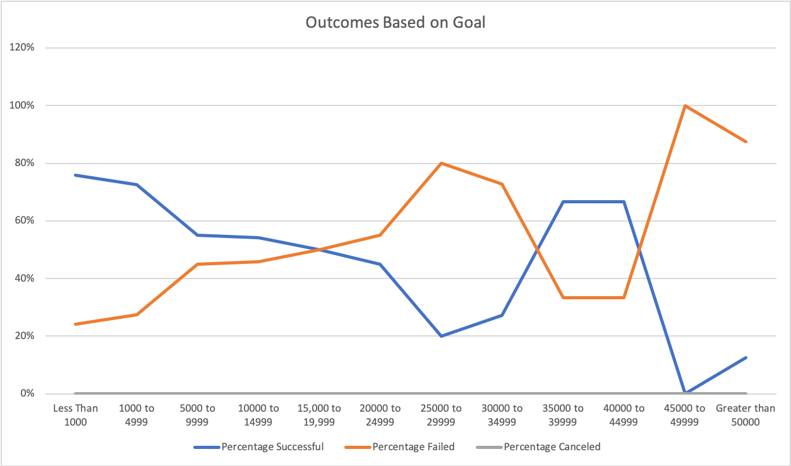
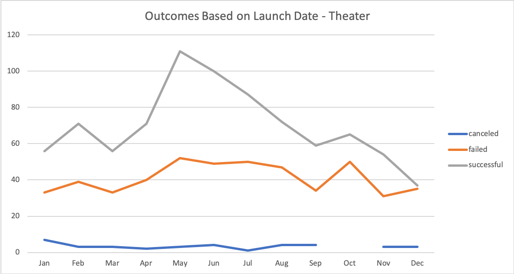

# Challenge_1-_Kickstarter_Analysis
### Kickstarter_Campaign_Outcomes_Based_on_Goal_and_Launch_Date
- Many of the Kickstarter Campaigns were successful for plays. According to the line chart below, we can visualized the outcomes for successful, failed and canceled rates based on different goal range. Percentage of successful is higher when goal is in the lower range. On the other hand, higher goal range tend to have higher percentage failed. 

- Theater is the most popular category among many other categories. Based on the line chart below, number of successful campaign has peak at May and relatively similar number at June. When Kickstarter just founded in 2009, there no theater at the time. As the years go by, the outcomes in Theater increases as well. 
su
